# Agentic Architecture — PFE Report System

## Overview

This repository contains a modular agentic architecture for maintaining and improving the PFE report on the STM32Cube Preprocessing Pipeline.

## Architecture Diagram

```mermaid
flowchart TD
    User([User / Abir]) --> Main[PFE Report Writer<br/>Main Orchestrator]
    
    Main --> RQA[Report Quality Analyzer]
    Main --> CRISP[CRISP-DM Alignment Agent]
    Main --> TD[Technology Documentation Agent]
    Main --> CA[Consistency Agent]
    Main --> PP[STM32Cube Preprocessing Agent]
    Main --> PDF[STM32Cube PDF Vision Agent]
    
    Main --> S1[latex-section-writer]
    Main --> S2[evaluation-analyzer]
    Main --> S3[generate-report-diagrams]
    Main --> S4[analyze-stats]
    Main --> S5[chunking-strategies]
    Main --> S6[document-json-schema]
    Main --> S7[crisp-dm-alignment]
    Main --> S8[technology-documentation]
    Main --> S9[consistency-checker]
    Main --> S10[report-quality-audit]
    
    Main --> Report[docs/reports/PFE_Report_STM32Cube_Pipeline.tex]
```



## Agents

| Agent | File | Role |
|-------|------|------|
| **PFE Report Writer** | `PFE_Report_Writer.agent.md` | Main orchestrator: reads report, detects gaps, delegates, writes LaTeX, validates |
| **Report Quality Analyzer** | `ReportQualityAnalyzer.agent.md` | Audits report quality, scores chapters, identifies gaps |
| **CRISP-DM Alignment Agent** | `CrispDmAlignmentAgent.agent.md` | Maps content to CRISP-DM, ensures methodological rigor |
| **Technology Documentation Agent** | `TechnologyDocAgent.agent.md` | Documents tech choices with justification and alternatives |
| **Consistency Agent** | `ConsistencyAgent.agent.md` | Detects duplicates, terminology drift, contradictions |
| **STM32Cube Preprocessing Agent** | `STM32CubePreprocessing.agent.md` | Pipeline analysis, validation, and technical documentation |
| **STM32Cube PDF Vision Agent** | `STM32CubePdfVision.agent.md` | PDF figure extraction and Alfred Vision enrichment |

## Skills

| Skill | Directory | Trigger |
|-------|-----------|---------|
| `latex-section-writer` | `skills/latex-section-writer/` | Writing LaTeX report sections |
| `evaluation-analyzer` | `skills/evaluation-analyzer/` | Interpreting QI results and benchmarks |
| `generate-report-diagrams` | `skills/generate-report-diagrams/` | Creating TikZ/Mermaid/draw.io diagrams |
| `analyze-stats` | `skills/analyze-stats/` | Analyzing pipeline statistical outputs |
| `chunking-strategies` | `skills/chunking-strategies/` | Comparing chunking configurations |
| `document-json-schema` | `skills/document-json-schema/` | Documenting JSON output schemas |
| `crisp-dm-alignment` | `skills/crisp-dm-alignment/` | Verifying CRISP-DM methodology coverage |
| `technology-documentation` | `skills/technology-documentation/` | Documenting and justifying tech choices |
| `consistency-checker` | `skills/consistency-checker/` | Detecting duplicates and contradictions |
| `report-quality-audit` | `skills/report-quality-audit/` | Full report quality scoring and planning |

## Workflow

### Normal Writing Flow
```
User provides content → Main Agent reads report → Delegates to skill → Produces LaTeX → Inserts → Validates
```

### Audit Flow
```
User requests audit → Main Agent invokes Report Quality Analyzer → Produces gap matrix → Plans improvements
```

### CRISP-DM Check Flow
```
Before writing → Main Agent invokes CRISP-DM skill → Gets phase mapping → Adds methodological link to content
```

### Consistency Check Flow
```
After writing → Main Agent invokes Consistency skill → Checks for conflicts → Fixes or flags
```

## Design Principles

1. **Incremental, not destructive**: Never rewrite existing good content
2. **Read before write**: Always inspect current state before modifying
3. **Explicit methodology**: CRISP-DM phase must be named, not assumed
4. **Quantified claims**: No statement without supporting data
5. **Visual support**: Architecture and flow concepts need diagrams
6. **Unified voice**: French academic register, consistent terminology
7. **Compilable output**: All LaTeX must compile without errors
