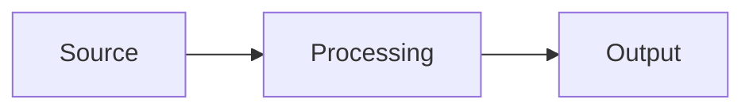

# Purpose

Generate professional diagrams and figures for the PFE report on the STM32Cube Preprocessing Pipeline. All diagrams must be suitable for an academic PFE defense presentation.

# Diagram Types

## 1. Architecture Globale (Pipeline 7 Stages)
- Show the full pipeline: Ingestion → Cleaning → Enrichment → Similarity → Chunking → Validation → Delivery
- Include inputs (GitHub API, local repos) and outputs (KB #793, ST ChatGPT)
- Use layered boxes with arrows showing data flow
- Color: STMicroelectronics blue (#1A238E) for pipeline stages

## 2. Diagramme Conceptuel RAG
- Query → Retrieve (KB search) → Augment (context injection) → Generate (LLM response)
- Show the feedback loop and citation mechanism
- Highlight the role of preprocessing in the Retrieve step

## 3. Data Flow (Source-to-Answer)
- GitHub repos → Ingestion scripts → raw_*.json → Cleaning → clean_*.json → Enrichment → docs_*.json → Similarity → _sim.json → Chunking → chunks_*.json → Delivery → st_ready_*.json → Upload → KB #793 → ST ChatGPT → User
- Show file naming convention at each stage

## 4. Agent Architecture (Multi-Tool)
- User → Persona (ST GitHub Analyzer) → Tool 1: KB Unstructured (Hybrid search) → Response with citations
- User → Persona → Tool 2: Alfred fallback (only when KB has no answer)
- Show KB fed by Pipeline, Pipeline fed by GitHub

## 5. Quality Index Evolution
- Bar chart or line chart: Date on X-axis, QI score on Y-axis
- Data points: 20 Apr (54), 20 Apr (57), 24 Apr (61), 28 Apr (94), 08 May (88), 02 Jun (83), 08 Jun (54)
- Annotate key changes ("+Diagnostic Cards", "+Multi-series", etc.)

## 6. Comparison Tables
- V2 vs V3 file sizes (CMSIS: 1.4MB→51KB, Release Notes: 45KB→30KB)
- Alfred vs Persona scores (20 questions, 6 criteria)
- Before/after enrichment (with/without Alfred images, with/without PDF descriptions)

## 7. Pipeline Stage Detail
- For each stage: script names, input files, output files, key transformations
- Use a structured table or multi-box diagram

## 8. Upload Flow
- JSON file → json-split-size 1000 → parts → base64 processor-params → HTTP POST → api-ai-bridge.st.com → KB datasource
- Show throttle (5s), retry (2x 30s), error handling

## 9. Cleaning V3 Decision Tree
- Input: file → detect_file_type() → route to strategy
- release_notes → strip_html()
- readme → clean_markdown()
- source_code → strip_license()
- cmsis_device_header (>100KB) → filter_cmsis_device_header() (keep IRQ, base addresses, TypeDef)
- other → passthrough

## 10. Delivery Artifacts
- Show 4 types with their relationships:
  - Issues (structured with metadata)
  - Files (HAL/BSP/CMSIS documentation)
  - Resolver Cases (Issue → PR → Commit chain)
  - Diagnostic Cards (Symptom → Root Cause → Fix)
- Show how they feed into the KB

# Output Formats

## TikZ (for direct LaTeX embedding)
```latex
\begin{figure}[H]
\centering
\begin{tikzpicture}[...]
  % diagram code
\end{tikzpicture}
\caption{Description en français}
\label{fig:diagram_name}
\end{figure}
```

## Mermaid (for Markdown preview and quick iteration)


## draw.io (for high-quality PNG export)
Provide a textual description of the layout, boxes, arrows, colors, and labels so the user can recreate it in draw.io.

# Style Guidelines

- **Colors**: Primary = STMicroelectronics blue (#1A238E), Secondary = light blue (#E3F2FD), Accent = orange (#FF6F00) for highlights
- **Fonts**: Sans-serif for labels, monospace for code/file names
- **Arrows**: thick, with labels describing the data transformation
- **Boxes**: rounded corners for processes, sharp corners for data files
- **Layout**: left-to-right for flows, top-to-bottom for hierarchies
- **Labels**: always in English for technical terms, French for descriptions
- **Every diagram MUST have**: `\caption{}` (French) and `\label{fig:...}` for cross-reference

# When to Use Each Format

| Situation | Format |
|-----------|--------|
| Embedded in LaTeX report | TikZ |
| Quick preview in conversation | Mermaid |
| High-quality figure for defense slides | draw.io description |
| Simple flowchart | Mermaid |
| Complex multi-layer architecture | TikZ or draw.io |
| Data comparison chart | TikZ (pgfplots) or table |
