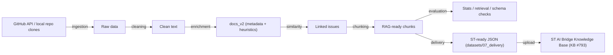

# STM32Cube Preprocessing Pipeline (PFE — STMicroelectronics)

This repository implements an intelligent **preprocessing and delivery pipeline**
that turns the public **STM32Cube** GitHub organization (issues, pull requests,
commits, source files, PDF figures) into a clean, enriched, chunked knowledge
base ready to power a **Retrieval-Augmented Generation (RAG) chatbot** on ST's
internal **AI Bridge** platform.

It is the codebase for a *Projet de Fin d'Études* (PFE) at STMicroelectronics,
and includes both the engineering pipeline/automation and the LaTeX academic
report describing the work.

## What this project does



1. **Ingestion** — fetch issues, PRs, commits, files and PDFs from
   `STMicroelectronics/STM32Cube*` repos (GitHub API + local git clones).
2. **Cleaning** — normalize and sanitize raw text.
3. **Enrichment** — extract metadata and apply STM32Cube-specific heuristics to
   build structured `docs_v2` documents.
4. **Similarity** — link related issues (TF-IDF).
5. **Chunking** — split enriched docs into retrieval-friendly chunks.
6. **Evaluation** — validate schemas, measure stats, simulate TF-IDF retrieval,
   check coherence of AI (Alfred)-generated content.
7. **Delivery** — export "ST-ready" JSON per series/repo.
8. **Upload** — push the ST-ready JSON to the ST AI Bridge persona Knowledge
   Base so it can be queried by the chatbot.

All 8 steps are orchestrated for every STM32Cube series (F0…H7, L0…L5, U0…U5,
WB/WBA/WL, N6, C0, G0/G4, …) so the resulting knowledge base covers the whole
STM32Cube ecosystem (main repos + BSP/HAL/driver/middleware sub-repos).

## Repository structure

```
PFE_Chatbot_STM32Cube/
├── pipeline/                  # Core preprocessing stages (see pipeline/README.md)
│   ├── ingestion/             # Fetch raw data from GitHub / local clones
│   ├── cleaning/              # Text normalization
│   ├── enrichment/            # Metadata extraction, docs_v2 generation
│   ├── similarity/            # Related-issue linking
│   ├── chunking/              # RAG chunk generation
│   ├── evaluation/            # Stats, retrieval tests, schema/coherence validation
│   ├── delivery/              # ST-ready JSON export
│   └── run_full_workflow.py   # End-to-end orchestration for one repo/series
├── pipeline_Automation/       # Orchestration, upload, AI enrichment, CI (see its README.md)
│   ├── workflow/              # Multi-series pipeline drivers
│   ├── upload/                # ST AI Bridge KB upload scripts
│   ├── alfred/                # Internal "Alfred" LLM enrichment/chat
│   ├── test_suites/           # QA test suite generation & grading
│   ├── utils/                 # Maintenance scripts
│   ├── jenkins/               # CI pipeline definition
│   └── bridge/                # Reserved for future AI Bridge client code
├── shared/                    # Config, schemas, and utilities shared by all stages
│   ├── config/                # Global + per-series JSON configuration
│   ├── schemas/                # JSON Schema contracts for docs/chunks
│   └── utils/                 # Path resolution helpers
├── datasets/                  # Pipeline outputs by maturity stage (01_raw → 07_delivery)
├── data/                      # Legacy/flat pipeline artifacts (chunks_*.json, etc.)
├── docs/                      # PFE report (LaTeX), guides, presentations, diagrams
├── GitHub_repos/              # Local clones of STM32Cube repos (gitignored, regenerable)
├── memories/                  # Local agent memory notes (gitignored)
├── .github/                   # Copilot agents/skills/instructions for this repo
└── requirements.txt           # Python dependencies
```

Every major subfolder has its own `README.md` with details and usage — see the
[Documentation map](#documentation-map) below.

## Getting started

### Prerequisites

- Python 3.10+ (a `.venv` virtual environment is expected at the repo root)
- `pip install -r requirements.txt` (installs `requests`, `scikit-learn`,
  `jsonschema`, `openpyxl`, `opencv-python-headless`, `PyMuPDF`, `python-pptx`)
- A GitHub token (for `pipeline/ingestion`) and, for upload/enrichment steps, an
  ST AI Bridge API key exported as one of `PERSONA_API_KEY`,
  `ST_GITHUB_ANALYZER_API_KEY`, `ST_CHATGPT_API_KEY`, `ST_AI_BRIDGE_API_KEY`, or
  `ST_API_KEY` (see [pipeline_Automation/upload/README.md](pipeline_Automation/upload/README.md))

### Setup (Windows / PowerShell)

```powershell
python -m venv .venv
.\.venv\Scripts\Activate.ps1
pip install -r requirements.txt
```

### Run the pipeline for one repo

```powershell
python -m pipeline.run_full_workflow --export-st-ready
```

### Run for a specific STM32Cube series

```powershell
$env:STM32CUBE_CONFIG = "shared/config/config_f4.json"
python -m pipeline.run_full_workflow --export-st-ready --skip-chunking --continue-on-error
```

### Run across all series / upload to the KB

See [pipeline_Automation/workflow/README.md](pipeline_Automation/workflow/README.md)
and [pipeline_Automation/upload/README.md](pipeline_Automation/upload/README.md),
or the full command reference in
[docs/pipeline_commands_reference.md](docs/pipeline_commands_reference.md).

## Documentation map

| Area | Where |
|---|---|
| Pipeline stages (ingestion → delivery) | [pipeline/README.md](pipeline/README.md) |
| Orchestration, upload, AI enrichment, CI | [pipeline_Automation/README.md](pipeline_Automation/README.md) |
| Shared config & schemas | [shared/README.md](shared/README.md) |
| Dataset layout (01_raw → 07_delivery) | [datasets/README.md](datasets/README.md) |
| Command cheat-sheet | [docs/pipeline_commands_reference.md](docs/pipeline_commands_reference.md) |
| PFE academic report (French, LaTeX) | [docs/reports/PFE_Report_STM32Cube_Pipeline.tex](docs/reports/PFE_Report_STM32Cube_Pipeline.tex) |
| Copilot agent system for this repo | [.github/AGENTS.md](.github/AGENTS.md) |

## Configuration

All scripts resolve configuration through
[shared/utils/paths.py](shared/utils/paths.py) (`get_config_path()`):

1. `STM32CUBE_CONFIG` env var, if set (points to a `shared/config/config_<series>.json`).
2. `shared/config/config.json` (default active config).
3. Legacy fallback under `src/config/config.json`.

See [shared/config/README.md](shared/config/README.md) for the full list of
per-series config files.

## Report (LaTeX)

The academic report is written in French, following the CRISP-DM methodology,
and lives in `docs/reports/`. Compile from that directory:

```powershell
cd docs/reports
pdflatex PFE_Report_STM32Cube_Pipeline.tex
```

## Coding conventions

- Python: type hints, `pathlib` for paths, `json` for configs, `argparse` for CLIs.
- Config resolved via `STM32CUBE_CONFIG` env var (never hardcode series paths).
- Tests: `py_compile` for syntax checks, `jsonschema` for data contract validation
  (see `pipeline/evaluation/validate_schemas.py`).
- Code comments/docstrings: English. The PFE report itself: French.
- Never hardcode API keys/tokens — always read them from environment variables
  or a local (gitignored) runtime config file.

## Known housekeeping items (not deleted — for maintainer review)

The following are safe cleanup candidates found while documenting the project;
they are left in place intentionally since automatic deletion wasn't requested:

- Stray root scripts: `.tmp_extract_issue_example.py`, `.tmp_inspect_checklist.py`
- Leftover LaTeX build log: `texput.log` (root and `docs/texput.log`)
- `tmp/` — leftover sample JSON/py files from manual debugging
- `docs/reports/*.aux|.log|.out|.toc` — regenerable LaTeX build artifacts
- `__pycache__/` folders throughout `pipeline/`, `pipeline_Automation/`, `shared/`
  (already excluded from git via `.gitignore`)
- `actions-runner/` — local self-hosted GitHub Actions runner **containing
  `.credentials` files**; already gitignored, keep local-only, do not commit
- `GitHub_repos/` — local clones of STM32Cube repos used as a raw data source;
  already gitignored, large, regenerable via `pipeline/ingestion/repo_sync_service.py`

## License / usage

Internal STMicroelectronics PFE project. Not licensed for external distribution.

