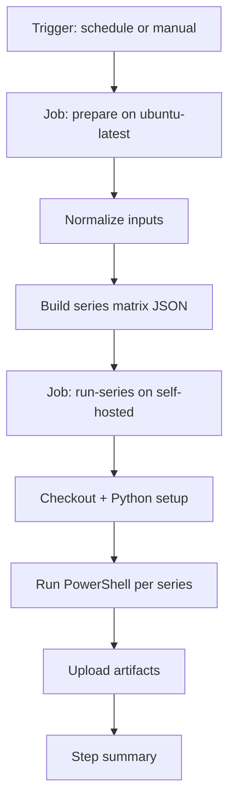

# GitHub Actions Automation — Detailed Guide

This document explains in detail how the workflow file works:

- `.github/workflows/auto_update_kb.yml`

It reflects the current implementation based on the per-series PowerShell orchestrator:

- `pipeline_Automation/workflow/Run_Single_Series_Full_Pipeline_And_Upload.ps1`

---

## 1) Purpose

The workflow automates full KB refresh for STM32Cube series.

For each selected series, it runs:

1. repository sync and submodule audit/fix
2. preprocessing pipeline
3. ST-ready exports (issues/files/resolver/diagnostic)
4. Alfred enrichments (images/PDF patches)
5. schema validation and placeholder policy gate
6. upload to KB #793

The workflow supports both:

- scheduled runs (bi-monthly)
- manual runs (with parameters)

---

## 2) High-Level Execution Flow



---

## 3) File Structure Explained (Section by Section)

### A. Workflow metadata

```yaml
name: Auto Update KB
```

Display name shown in GitHub Actions UI.

### B. Triggers (`on`)

```yaml
on:
    schedule:
        - cron: '0 3 1,15 * *'
    workflow_dispatch:
        inputs: ...
```

- `schedule`: automatic run at 03:00 UTC, on day 1 and 15 of each month.
- `workflow_dispatch`: manual run button with custom inputs.

#### Manual inputs

| Input | Type | Default | Meaning |
|---|---|---|---|
| `series` | string (CSV) | `G4,L0,L1,L4,L5,N6,U0,U3,WB,WB0,WBA,WL3` | Which series to process |
| `mode` | choice | `Full` | `Full`, `Prepare`, or `Upload` |
| `existing_datasource_mode` | choice | `Replace` | Existing datasource policy (`Replace`, `Add`) |
| `skip_drivers` | boolean | `false` | Skip drivers/subrepo uploads |
| `skip_schema_validation` | boolean | `false` | Disable schema gate |
| `continue_on_workflow_error` | boolean | `false` | Continue when one repo fails inside workflow |
| `placeholder_policy` | choice | `Fail` | Policy for unresolved Alfred placeholders (`Fail`, `Warn`, `Off`) |
| `max_parallel` | string | `1` | Maximum parallel series jobs |

### C. Permissions

```yaml
permissions:
    contents: read
```

Minimal repository read permission for checkout.

### D. Concurrency control

```yaml
concurrency:
    group: auto-update-kb-${{ github.ref }}
    cancel-in-progress: false
```

Prevents overlapping runs on same branch/reference.

### E. Global env defaults

```yaml
env:
    PYTHON_VERSION: '3.12'
    DEFAULT_SERIES: '...'
    DEFAULT_MODE: 'Full'
    DEFAULT_EXISTING_DATASOURCE_MODE: 'Replace'
    DEFAULT_PLACEHOLDER_POLICY: 'Fail'
    DEFAULT_MAX_PARALLEL: '1'
```

Used when trigger is `schedule` (no manual inputs provided).

---

## 4) Job 1 — `prepare`

### Why it exists

This job transforms raw workflow inputs into clean outputs consumed by the matrix job.

### Runtime

- Runner: `ubuntu-latest`
- Output variables exported through `GITHUB_OUTPUT`

### Key logic in `Normalize workflow inputs`

1. If manual run (`workflow_dispatch`): read provided inputs.
2. If scheduled run: use env defaults.
3. Execute inline Python to normalize `series`:
     - uppercase all entries
     - trim whitespace
     - remove duplicates
     - validate against allowed set:
         - `G4, L0, L1, L4, L5, N6, U0, U3, WB, WB0, WBA, WL3`
4. Emit JSON array for matrix strategy (example: `['G4','L4','U0']`).
5. Emit all normalized flags/mode/policy as job outputs.

### Outputs produced

| Output | Used by |
|---|---|
| `series_json` | matrix series list |
| `mode` | script argument |
| `existing_datasource_mode` | script argument |
| `skip_drivers` | script switch |
| `skip_schema_validation` | script switch |
| `continue_on_workflow_error` | script switch |
| `placeholder_policy` | script argument |
| `max_parallel` | matrix parallelism |

---

## 5) Job 2 — `run-series`

### Runtime characteristics

- Runner: `self-hosted` (Windows runner expected)
- Timeout: 360 minutes per series job
- Strategy:
    - `fail-fast: false` (one series failure does not cancel others)
    - `max-parallel` controlled by input/output
    - matrix over normalized series list

### Secrets used

| Secret | Purpose |
|---|---|
| `ST_CHATGPT_API_KEY` | ST AI Bridge authentication |
| `ST_REMOTE_USER` | uploader identity (passed to script) |
| `GITHUB_TOKEN` | Git operations/API access |

### Steps breakdown

1. `actions/checkout@v4`
     - gets repository code on runner.

2. Enable long paths
     - runs: `git config --system core.longpaths true`
     - avoids Windows path-length failures.

3. `actions/setup-python@v5`
     - uses Python `3.12`
     - enables pip cache.

4. Install dependencies
     - `python -m pip install --upgrade pip`
     - `pip install -r requirements.txt`

5. Run per-series script
     - script path:
         - `pipeline_Automation/workflow/Run_Single_Series_Full_Pipeline_And_Upload.ps1`
     - arguments wired from matrix + prepare outputs:
         - `-Series`
         - `-Mode`
         - `-ExistingDatasourceMode`
         - `-RemoteUser`
         - `-KbId 793`
         - `-JsonSplitSize 1000`
         - `-PlaceholderPolicy`
     - optional switches added conditionally:
         - `-SkipDrivers`
         - `-SkipSchemaValidation`
         - `-ContinueOnWorkflowError`

6. Upload artifacts (`if: always()`)
     - artifact name: `st-ready-<SERIES>-<RUN_NUMBER>`
     - path: `datasets/07_delivery/st_ready/by_series/`
     - retention: 30 days
     - still runs even if script step fails.

7. Write GitHub step summary (`if: always()`)
     - records mode and flags used for traceability.

---

## 6) How Inputs Map to Script Behavior

| Workflow input | Script parameter | Practical effect |
|---|---|---|
| `series` | `-Series` (matrix item) | selects target series |
| `mode` | `-Mode` | `Prepare` only prep, `Upload` only upload, `Full` both |
| `existing_datasource_mode` | `-ExistingDatasourceMode` | `Replace` refreshes existing datasource, `Add` appends |
| `skip_drivers` | `-SkipDrivers` | no driver/subrepo uploads |
| `skip_schema_validation` | `-SkipSchemaValidation` | bypass schema gate |
| `continue_on_workflow_error` | `-ContinueOnWorkflowError` | continue inside workflow when repo fails |
| `placeholder_policy` | `-PlaceholderPolicy` | `Fail/Warn/Off` for unresolved Alfred placeholders |
| `max_parallel` | matrix strategy | controls concurrent series jobs |

---

## 7) What Is Generated During a Run

Main outputs are under:

- `datasets/07_delivery/st_ready/by_series/stm32cube<series>/...`

Typical folders per series:

- `issues_json`
- `files_json`
- `resolver_cases_json`
- `diagnostic_cards_json`
- `drivers/...` for subrepo outputs

Datasource IDs are persisted by the script in:

- `upload_datasource_ids_<slug>.json`

The file is updated incrementally during upload (issues, files, diagnostic, resolver),
so newly created datasource IDs are persisted immediately even if a later step fails.
It now includes `last_successful_stage` to indicate the latest completed checkpoint.

---

## 8) Failure and Recovery Model

### Validation failures

- If schema or placeholder gates fail (depending on policy), the script exits with error.
- Series job is marked failed; other series can continue because `fail-fast: false`.

### Existing datasource name conflicts

- Datasource conflict is handled by uploader logic.
- In `operation=new`, if datasource name already exists, uploader resolves existing datasource ID and applies `existing_datasource_mode` policy:
    - `Replace`: clear datasource content, then upload fresh files.
    - `Add`: append uploaded files to existing datasource content.
- If ID cannot be resolved, uploader retries creation with an auto-suffixed datasource name.
- In `Replace`, existing-file conflicts are treated as blocking errors (strict mode), not skipped.

Relevant implementation:

- [pipeline_Automation/upload/Add_Data_Source_Files.py](pipeline_Automation/upload/Add_Data_Source_Files.py#L449)
- [pipeline_Automation/upload/Add_Data_Source_Files.py](pipeline_Automation/upload/Add_Data_Source_Files.py#L1567)
- [pipeline_Automation/upload/Add_Data_Source_Files.py](pipeline_Automation/upload/Add_Data_Source_Files.py#L1675)

### Self-hosted runner offline handling

- Workflow now checks runner availability before execution.
- If no online self-hosted runner is detected, series jobs are skipped and a clear "Upload Deferred" summary is published instead of hanging in queue.
- Re-run is required when runner is back online.

Relevant implementation:

- [.github/workflows/auto_update_kb.yml](.github/workflows/auto_update_kb.yml#L131)
- [.github/workflows/auto_update_kb.yml](.github/workflows/auto_update_kb.yml#L167)
- [.github/workflows/auto_update_kb.yml](.github/workflows/auto_update_kb.yml#L247)

### Partial uploads

- Script is idempotent-friendly by reusing saved datasource IDs when present.
- `mode=Upload` can be used to retry upload only.

### Runner issues

- If self-hosted runner is offline, matrix jobs stay queued.

---

## 9) Operational Runbook

### Preconditions

1. self-hosted runner online
2. repository secrets configured:
     - `ST_CHATGPT_API_KEY`
     - `ST_REMOTE_USER`
3. access to ST AI Bridge from runner network

### Safe manual smoke test

- `series`: `G4`
- `mode`: `Prepare`
- `skip_drivers`: `true`
- `skip_schema_validation`: `false`
- `continue_on_workflow_error`: `false`
- `placeholder_policy`: `Warn`
- `max_parallel`: `1`

Then promote to:

- `mode`: `Full`
- desired full series list

---

## 10) Quick FAQ

### Why two jobs instead of one?

`prepare` sanitizes/validates inputs and builds matrix cleanly. `run-series` focuses only on execution.

### Why self-hosted for execution?

Upload and environment constraints are tied to ST network/runtime dependencies.

### Why `max_parallel` default is 1?

Safer on a single Windows runner. Increase only if multiple runners/resources are available.

---

## 11) File References

- Workflow: `.github/workflows/auto_update_kb.yml`
- Main script: `pipeline_Automation/workflow/Run_Single_Series_Full_Pipeline_And_Upload.ps1`
- Commands reference: `docs/pipeline_commands_reference.md`
- Jenkins-only architecture: `docs/jenkins_only_kb_automation.md`
- Jenkins full pipeline file: `pipeline_Automation/jenkins/Jenkinsfile_GitHubArtifactsToKB.groovy`
