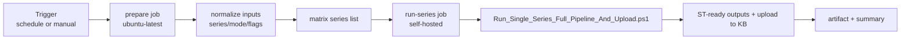

# GitHub Actions Automation — Presentation Version

Generate the real PPTX file with:

python docs/scripts/generate_automation_pptx.py

Output file:

docs/automation_kb_update_presentation.pptx

## Slide 1 — What It Does

### Mission

Keep KB #793 (ST GitHub Analyzer) continuously updated with fresh STM32Cube data.

### Trigger Modes

- Scheduled: every 1st and 15th at 03:00 UTC
- Manual: GitHub Actions Run workflow with parameters

### Execution Model

- Job 1 (`prepare`, cloud Ubuntu): normalize inputs and build matrix
- Job 2 (`run-series`, self-hosted Windows): execute one series per matrix entry

### Core File

- [.github/workflows/auto_update_kb.yml](.github/workflows/auto_update_kb.yml)

---

## Slide 2 — How It Works (In Practice)

### Manual Inputs

| Input | Purpose | Typical Value |
|---|---|---|
| `series` | choose series list | `G4,L4,U0` |
| `mode` | execution mode | `Full` |
| `existing_datasource_mode` | existing datasource behavior | `Replace` |
| `skip_drivers` | skip subrepo uploads | `false` |
| `skip_schema_validation` | bypass schema gate | `false` |
| `continue_on_workflow_error` | continue if one repo fails | `false` |
| `placeholder_policy` | Alfred placeholder policy | `Fail` |
| `max_parallel` | matrix concurrency | `1` |

### Per-Series Script Called by Workflow

- [pipeline_Automation/workflow/Run_Single_Series_Full_Pipeline_And_Upload.ps1](pipeline_Automation/workflow/Run_Single_Series_Full_Pipeline_And_Upload.ps1)

This script performs:

1. repo sync + config submodule audit/fix
2. preprocessing workflow execution
3. ST-ready exports (issues/files/resolver/diagnostic)
4. Alfred enrichment and PDF patching
5. schema validation + placeholder gate
6. upload to KB #793

### Secrets Required

- `ST_CHATGPT_API_KEY`
- `ST_REMOTE_USER`

### Why Self-Hosted Runner

- Windows-specific execution path
- network/runtime constraints for enterprise upload flow

### Success Criteria

- series job completes
- artifact uploaded (`st-ready-<SERIES>-<RUN_NUMBER>`)
- summary generated in GitHub Actions UI

---

## Speaker Notes (Optional)

- The design separates input normalization (`prepare`) from execution (`run-series`) for reliability.
- Matrix + `fail-fast: false` allows one series to fail without cancelling the others.
- Default `max_parallel=1` is intentional for single-runner stability.
- `mode=Prepare` is ideal for safe smoke tests before full production upload.