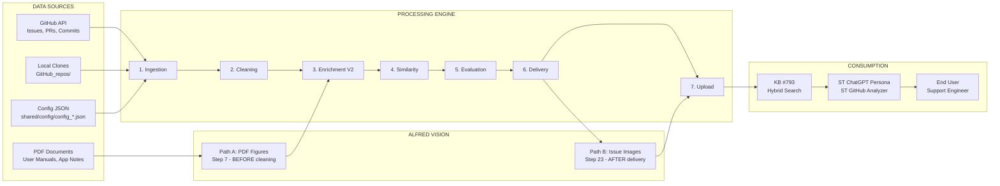
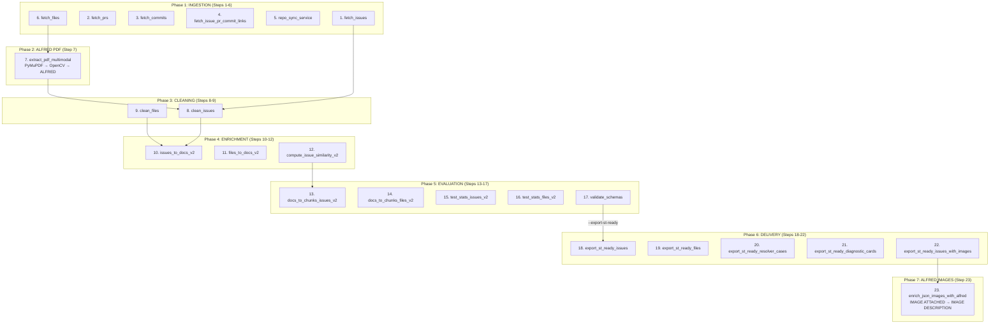
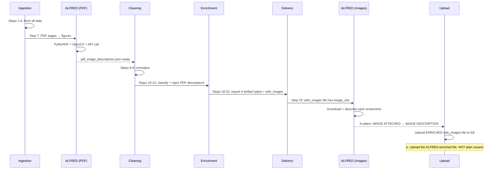

# Pipeline Architecture Diagrams

These diagrams are also available as `.drawio` files in this directory for editing.
Below are **Mermaid** versions you can preview directly in VS Code (Ctrl+Shift+V) or any Markdown viewer.

---

## 1. Master Architecture

---

## 2. Full Pipeline — 23 Steps

---

## 3. ALFRED Vision — Two Paths

```mermaid
graph TD
    subgraph "Path A: PDF Figure Enrichment (Step 7)"
        PA1[PDF Documents<br/>in GitHub_repos/]
        PA2[PyMuPDF: render pages<br/>→ data/pdf_pages/*.png]
        PA3[OpenCV: detect & crop figures<br/>→ data/pdf_figures/*.png]
        PA4[Build JSONL task file<br/>→ data/pdf_image_tasks_*.jsonl]
        PA5[ALFRED Vision API<br/>api-ai-bridge.st.com]
        PA6[Output: data/pdf_image_descriptions.json<br/>242 descriptions, 19 series]
        PA7[Inject into files_to_docs_v2<br/>→ FIGURE_DESCRIPTIONS blocks]

        PA1 --> PA2 --> PA3 --> PA4 --> PA5 --> PA6 --> PA7
    end

    subgraph "Path B: Issue Image Enrichment (Step 23)"
        PB1[st_ready_issues_with_images_*.json<br/>contains image_urls field]
        PB2[Download screenshots<br/>from GitHub CDN]
        PB3[ALFRED Vision API<br/>same client, same endpoint]
        PB4[Replace text in-place<br/>IMAGE ATTACHED → IMAGE DESCRIPTION]
        PB5[Result: enriched file<br/>ready for KB upload]

        PB1 --> PB2 --> PB3 --> PB4 --> PB5
    end

    subgraph "Shared Infrastructure"
        SI1[API: api-ai-bridge.st.com]
        SI2[Client: mdrf_stgithub_analyzer_client]
        SI3[Rate limit: ~20 req before throttle]
        SI4[Retry: delay 5s, retry 2x, backoff 30s]
    end
```

---

## 4. ALFRED Integration Timing in Pipeline

---

## How to View

- **VS Code**: Install "Markdown Preview Mermaid Support" extension, then Ctrl+Shift+V
- **GitHub**: Mermaid renders natively in .md files
- **draw.io**: Open the `.drawio` files with draw.io desktop app or VS Code draw.io extension
