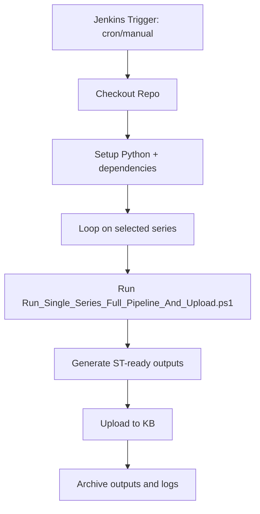

# Jenkins-Only Automation (No GitHub Actions)

## Scope

This document describes a full Jenkins architecture where preprocessing and KB upload run entirely in Jenkins.

## Architecture

## Implemented Jenkins pipeline

- File: pipeline_Automation/jenkins/Jenkinsfile_GitHubArtifactsToKB.groovy
- Behavior: full Jenkins orchestration (no artifact download from GitHub Actions)
- Schedule: bi-monthly (`H 3 1,15 * *`)

## Required Jenkins credentials

- `st-remote-user` (String credential, email)
- `st-chatgpt-api-key` (String credential)
- `github-token` (optional but recommended for ingestion robustness)

## Parameters

- `SERIES`: CSV list of series
- `MODE`: `Full | Prepare | Upload`
- `EXISTING_DATASOURCE_MODE`: `Replace | Add`
- `PLACEHOLDER_POLICY`: `Fail | Warn | Off`
- `KB_ID`: default 793
- `JSON_SPLIT_SIZE`: default 1000
- `PYTHON_EXE`: optional python override
- `SKIP_DRIVERS`: boolean
- `SKIP_SCHEMA_VALIDATION`: boolean
- `CONTINUE_ON_WORKFLOW_ERROR`: boolean
- `CONTINUE_ON_SERIES_FAILURE`: boolean

## Test instructions

### Test 1: Smoke test (fast)

1. Run Jenkins job manually with:
   - `SERIES=G4`
   - `MODE=Prepare`
   - `SKIP_DRIVERS=true`
   - `SKIP_SCHEMA_VALIDATION=false`
   - `PLACEHOLDER_POLICY=Warn`
2. Verify job succeeds and ST-ready outputs are generated in `datasets/07_delivery/st_ready/by_series/`.

Expected:

- No upload performed (Prepare mode).
- Delivery tree for G4 is created.

### Test 2: Upload-only test

1. Run Jenkins job with:
   - `SERIES=G4`
   - `MODE=Upload`
   - `EXISTING_DATASOURCE_MODE=Replace`
2. Verify upload logs show datasource operations and returned IDs.

Expected:

- Upload completes without rerunning full prepare.
- IDs snapshot updated in series delivery folder.

### Test 3: End-to-end single series

1. Run Jenkins job with:
   - `SERIES=G4`
   - `MODE=Full`
   - `EXISTING_DATASOURCE_MODE=Replace`
   - `PLACEHOLDER_POLICY=Fail`
2. Verify both preprocessing and upload complete.

Expected:

- Full output set generated (issues/files/diagnostic/resolver).
- KB upload executed.

### Test 4: Multi-series resilience

1. Run with:
   - `SERIES=G4,L4,U0`
   - `MODE=Full`
   - `CONTINUE_ON_SERIES_FAILURE=true`
2. Simulate one failing series (optional).

Expected:

- Other series continue.
- Build ends failed if any series failed (with explicit list).

## Rollback

If you want to disable Jenkins-only automation, disable Jenkins cron trigger and run manually only.

## Operational notes

- This architecture removes dependency on GitHub Actions runtime for execution.
- Ensure Jenkins agent has stable ST network access to upload endpoints.
- Keep Jenkins workspace retention and archived artifacts under control for disk usage.
